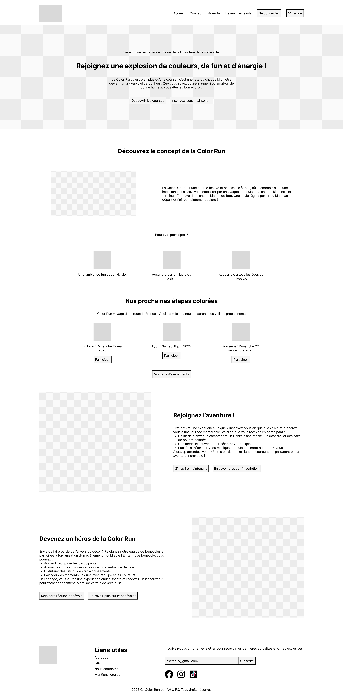

# Color Run – Application React avec DaisyUI et React Router

Ce projet propose l'intégration d'une **landing page** au sein d'une application **React** configurée avec **Vite**. L'interface est construite avec **Tailwind CSS** et **DaisyUI**, tandis que la navigation entre les pages est gérée grâce à **React Router DOM**.

-   Wireframe
    

---

## Caractéristiques de la Landing Page

1. **Basée sur DaisyUI** :
    - La landing page utilise **DaisyUI**, une librairie de composants Tailwind CSS qui simplifie la création d'interfaces grâce à des composants prêts à l'emploi.
    - Les styles des éléments (boutons, formulaires, cartes, etc.) proviennent des classes spécifiques de DaisyUI.
2. **Personnalisation grâce aux thèmes DaisyUI** :
    - Les couleurs de la page sont définies par le **thème DaisyUI** sélectionné.
    - DaisyUI propose plusieurs thèmes intégrés que vous pouvez utiliser ou personnaliser selon vos besoins.
3. **Flexibilité et adaptabilité** :
    - Vous êtes encouragés à modifier cette landing page selon vos besoins et préférences.
    - Elle sert de base pour développer les autres pages de votre projet, en maintenant une cohérence visuelle et fonctionnelle.
    - Les bibliothèques sont installées via npm afin de profiter de l’auto-complétion des classes dans votre éditeur.

---

## Routing avec React Router DOM

La navigation est centralisée dans `src/main.jsx` via `createBrowserRouter` et `RouterProvider`.

-   Le composant `Layout` contient la structure commune des pages.
-   Chaque nouvelle page doit être ajoutée comme route au sein du tableau passé à `createBrowserRouter`.

---

## Consignes pour le projet

1. **Création des autres pages** :
    - Pour chaque nouvelle page, il est recommandé de réaliser un **wireframe** similaire à celui fourni pour la page d'accueil.
    - Ces wireframes serviront de guide pour la structure et la disposition des éléments sur vos pages.
2. **Utilisation de Tailwind CSS et DaisyUI** :
    - Basez-vous sur **Tailwind CSS** et **DaisyUI** pour concevoir les interfaces de vos pages.
    - Utilisez les classes utilitaires de Tailwind pour le style et les composants de DaisyUI pour une mise en page rapide et cohérente.
3. **Réalisation des formulaires de connexion et d'inscription** :
    - Créez des formulaires de connexion et d'inscription en vous appuyant sur les composants de formulaires fournis par DaisyUI.
    - Assurez-vous que ces formulaires sont fonctionnels, esthétiques et adaptés aux différentes tailles d'écran.

---

## Installation et lancement

1. **Prérequis** : Node.js 18 ou version supérieure.
2. **Installation des dépendances** :
    ```bash
    npm install
    ```
3. **Démarrer le serveur de développement** :
    ```bash
    npm run dev
    ```
    L'application est accessible sur [http://localhost:5173](http://localhost:5173).
4. **Analyse statique du code** :
    ```bash
    npm run lint
    ```
5. **Construire la version de production** :
    ```bash
    npm run build
    ```
6. **Prévisualiser le build de production** :
    ```bash
    npm run preview
    ```

---

## Ressources Utiles

-   **Documentation de React** : [react.dev](https://react.dev)
-   **Documentation de React Router** : [reactrouter.com](https://reactrouter.com)
-   **Documentation de DaisyUI** : Consultez la documentation officielle pour comprendre comment intégrer et personnaliser les composants.
    [daisyUI](https://v5.daisyui.com/docs/themes/)
-   **Tutoriels sur les formulaires avec Tailwind CSS et DaisyUI** : Des guides sont disponibles pour vous aider à créer des formulaires élégants et fonctionnels.
    [Tailwind Tap](https://www.tailwindtap.com/blog/tailwind-css-daisyui-form-tutorial)
-   **Générateur de thèmes DaisyUI** : Utilisez cet outil pour créer des thèmes personnalisés adaptés à votre projet.
    [DaisyUI theme generator](https://www.daisyuitheme.com/)
